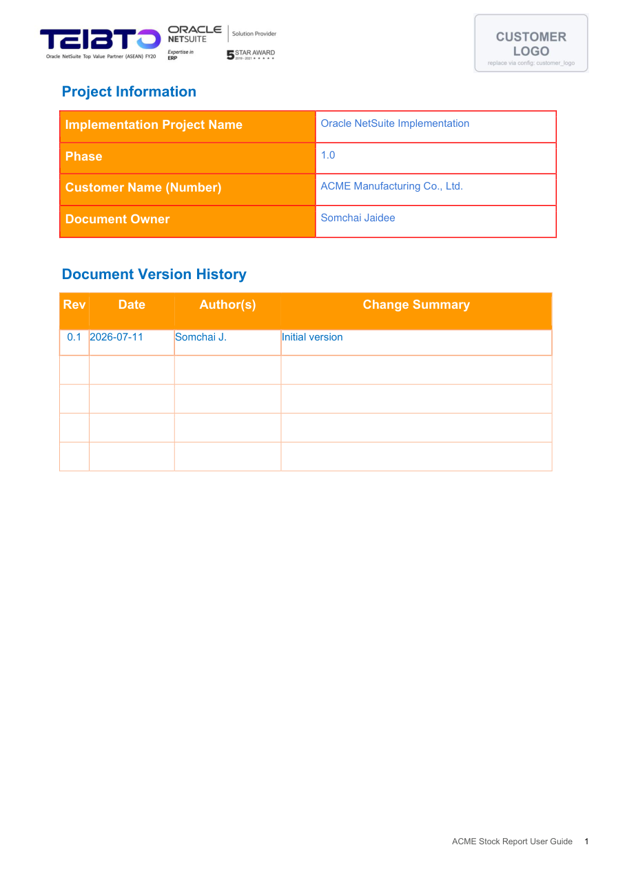
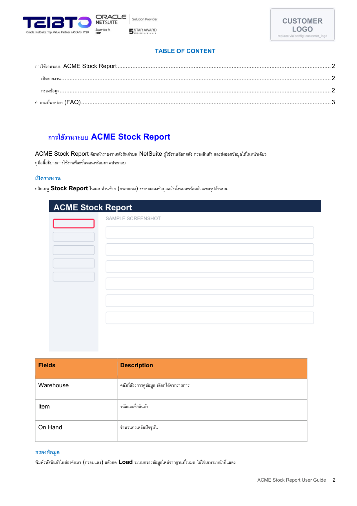
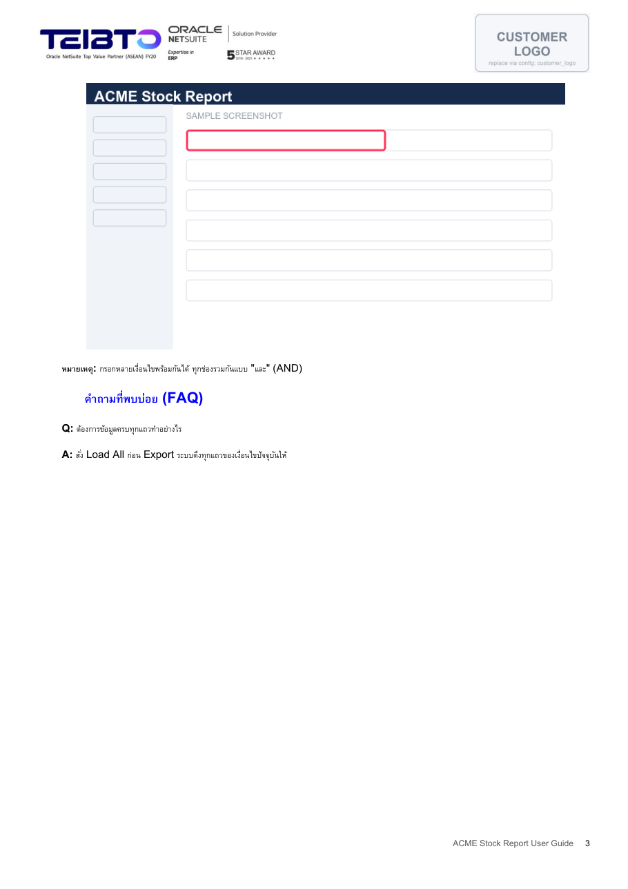

# User Guide มาตรฐาน Teibto (.docx)

เอกสารนี้สำหรับทีม Teibto ทุกคนที่ต้องส่ง User Guide ให้ลูกค้า อ่านแล้วสร้างเล่ม .docx
ตาม layout มาตรฐาน (ปก · Project Information · Version History · สารบัญอัตโนมัติ ·
header โลโก้ · footer เลขหน้า · ตาราง Fields/Description) ได้ใน 1 คำสั่ง

## หน้าตาเล่มที่ได้

ตัวอย่างสำเร็จรูปเปิดดูได้ที่ [example/TEIBTO-USERGUIDE.example.docx](example/TEIBTO-USERGUIDE.example.docx)
(สร้างจาก [example/sample.md](example/sample.md) + [example/sample.config.json](example/sample.config.json))

| ปก | Project Information | สารบัญ | เนื้อหา + FAQ |
|---|---|---|---|
|  |  |  |  |

กรอบ "CUSTOMER LOGO" มุมขวาบนคือ placeholder — ใส่โลโก้จริงของลูกค้าผ่าน config
(`customer_logo`) ตอนสร้างเล่ม template กลางไม่ผูกกับลูกค้ารายใด

## ต้องมี

- Python 3 + `pip install python-docx` (ครั้งเดียว)
- ภาพหน้าจอของระบบที่จะเขียนถึง (แนะนำเก็บด้วย skill `agent-browser-qa`
  จะได้ภาพพร้อมกรอบไฮไลต์ กรอบแดง = จุดคลิก · กรอบเขียว = จุดสังเกต)

## ขั้นตอน

0. **อ่าน [references/thai-userguide-style.md](../thai-userguide-style.md) ก่อนลงมือเขียน** — คุมสำนวนภาษาไทย
   (คำเรียกผู้อ่าน · โครงบท · คำกริยามาตรฐาน · การเขียนกรณียกเว้น · สิ่งที่ห้ามหลุดเข้าเล่ม)
   ไฟล์นี้คุม layout ส่วนไฟล์นั้นคุมคำ เขียนเสร็จแล้วไล่เช็คอีกรอบตามข้อ 12 ของไฟล์นั้น
1. เขียนเนื้อหาเป็น Markdown (subset เต็มดูหัวไฟล์ `scripts/build_userguide.py`):
   `#` = บทใหญ่ (ขึ้นสารบัญ, ใส่ icon ได้ผ่าน config `chapter_icons`) · `##`/`###` = หัวข้อรอง ·
   `## ขั้นที่ N ...` = หัวข้อขั้นตอนพร้อม badge วงกลมเลข · `- ` / `1. ` = bullet / numbered list ·
   `` = ภาพกลางหน้า + caption "ภาพที่ n" อัตโนมัติ ·
   ตาราง `| |` = ตารางหัวส้ม + zebra stripe · `> หมายเหตุ:` / `> ข้อควรระวัง:` / `> ทริค:` =
   กล่องสีฟ้า/เหลือง/เขียวพร้อม icon · inline: `` `code` `` · `[btn:Load]` = ป้ายปุ่ม ·
   `[pill:ครบ]` = รูปป้ายสถานะจาก `assets/pill-<ชื่อ>.png` ข้างไฟล์ .md
2. สร้าง config ของลูกค้า (ตัวอย่างเต็มอยู่หัวไฟล์ script เช่นกัน):

   ```json
   {
     "title_th": "คู่มือการใช้งาน<ระบบ>",
     "title_en": "<System> User Guide",
     "customer": "<Customer> Co., Ltd.",
     "customer_full": "<CUSTOMER> CO.,LTD.",
     "owner": "<Document Owner>",
     "doc_name": "<ชื่อใน footer>",
     "customer_logo": "logo.jpg",
     "history": [
       { "rev": "0.1", "date": "11-Jul-2026", "author": "<ชื่อย่อ>", "summary": "Initial version" }
     ]
   }
   ```

3. สร้างเล่ม — **prefix ชื่อไฟล์ = ตัวย่อลูกค้าของโปรเจกต์นั้น** (เช่น ACME = `ACME-`)
   ไม่ใช่ก๊อป prefix จากตัวอย่างไปทุกงาน:

   ```bash
   python scripts/build_userguide.py guide.md --config customer.json -o "<ตัวย่อลูกค้า>-User Guide_<ชื่อระบบ>.docx"
   # ตัวอย่าง: "ACME-User Guide_Stock Report.docx"
   ```

4. ตรวจปกกับ Version History แล้วส่งได้เลย — สารบัญถูกอัปเดตให้อัตโนมัติ: เครื่องที่มี MS Word
   script จะ bake เลขหน้าจริงลงไฟล์ (ขึ้นข้อความ "สารบัญถูกอัปเดตในไฟล์แล้ว") ส่วนเครื่องที่ไม่มี Word
   ไฟล์ถูกตั้ง `updateFields` ให้ Word ฝั่งผู้เปิดคำนวณใหม่เอง (หรือกด `Ctrl+A` แล้ว `F9`)

> หมายเหตุ: สารบัญใน template เป็น Word field ที่ยังไม่ได้คำนวณ จะเห็นเป็น "หัวข้อตัวอย่าง 1, 2, …"
> ถ้าเปิด template ตรง ๆ เล่มที่ build แล้วจะได้สารบัญจริงตามขั้นที่ 4

## Branding + assets กลาง (canonical — ไม่ต้องไปเปิดเล่มลูกค้าดู)

**ชื่อไฟล์:** prefix = ตัวย่อลูกค้าของโปรเจกต์ (เช่น ACME = `ACME-`)
งาน **internal ของ Teibto** = prefix **`TBT-`** พร้อม config:

```json
{
  "customer": "Teibto Co., Ltd.",
  "customer_full": "TEIBTO CO.,LTD.",
  "customer_logo": "<path ไป assets/branding/teibto-logo-header.jpg>"
}
```

**โลโก้ header:** กล่อง header แสดง 1.52×0.78 นิ้ว (อัตราส่วน ~1.95:1) — โลโก้ที่กว้างกว่านั้น
ต้องวางลงผืนขาวก่อน ไม่งั้นถูกบีบ ของ Teibto ทำไว้แล้วที่
[`assets/branding/teibto-logo-header.jpg`](assets/branding/teibto-logo-header.jpg)
(1400×718) ให้ copy ไปไว้ข้าง config ของเล่ม

**Chapter icons:** ชุดกลางอยู่ที่ [`assets/icons/`](assets/icons/) (flat navy 300×300,
โทนเดียวกับ badge ขั้นตอน) — เลือกตามความหมายบท ไม่ต้องวาดใหม่:
`ic-overview` ภาพรวม · `ic-upload` อัปโหลดไฟล์ · `ic-deploy` ติดตั้ง/สร้าง record ·
`ic-run` การใช้งาน/สั่งรัน · `ic-monitor` ติดตามสถานะ · `ic-verify` ตรวจผล/ความถูกต้อง ·
`ic-schedule` ตั้งเวลา · `ic-faq` คำถามพบบ่อย · `ic-glossary` อภิธานศัพท์

**Cover artwork (`cover_image`):** ผืน 1920×1169 สไตล์ทีม — พื้นไล่สีขาว→ฟ้าอ่อน
(ล่างสุด ~`#E0E7F7`) + เส้น grid ทุก 96px สี `#E2EAF4` + pictogram flat 2–3 ชิ้นเล่าคอนเซ็ปต์ระบบ
(น้ำเงิน `#1F3A5F` / เขียว `#1E8E5A` / ส้ม `#B45309`) + ป้ายไทย 1 บรรทัด
**font Sarabun เท่านั้น** (ดาวน์โหลดได้จาก Google Fonts)
เนื้อหาวางครึ่งบนของผืน (ครึ่งล่างโดนช่วงล่างปกบัง)

## กติกา

- `customer_logo` ต้องเป็น `.jpg` (โลโก้มุมขวาของ header ทุกหน้า ขนาดแสดง 1.52×0.78 นิ้ว)
  ถ้าเป็น .png ให้ติดตั้ง Pillow (`pip install pillow`) script จะแปลงให้
- เนื้อหาภาษาไทย: ไทยนำ ศัพท์เทคนิคทับศัพท์ เว้นวรรคหน้า-หลังคำอังกฤษ ไม่มี emoji ในเนื้อหา
  รายละเอียดสำนวนอยู่ใน [thai-userguide-style.md](../thai-userguide-style.md)
- ออกเวอร์ชันใหม่ = เพิ่มแถวใน `history` (script เติมแถวในตาราง Version History ให้เอง)

## จัดหน้าให้ประหยัด (page economy) — กันเล่มบวมและเปลืองหน้า

อาการ: เล่มยาวเกินจริง หลายหน้ามี white space ครึ่งหน้า เพราะรูปแนวตั้ง/จัตุรัส (property panel, full-screen, modal) ถูกยืดกว้าง 6.3" จนสูงเกือบเต็มหน้า แล้วหัวข้อถัดไปถูกดันตกหน้าใหม่

กติกาที่จ่ายบทเรียนแล้ว (2026-07-20, PLD guide ลด 34 → 23 หน้า):

- **เพดานความสูงรูปมีแล้วใน script** — ทุกภาพถูกจำกัด ≤ 3.8" อัตโนมัติ (คงสัดส่วน) ปรับได้ผ่าน config
  `"max_image_height_in": 3.2` (เตี้ยลง = ประหยัดหน้าขึ้น แต่ตัวหนังสือในภาพเล็กลง)
- **ตารางชนะภาพสำหรับข้อมูล reference** — คุณสมบัติที่เป็นรายการ (เช่น property ของ element 8 ชนิด,
  ตัวเลือกคอลัมน์, ตัวเลือก pagination) ใช้ **ตารางสรุป** + ภาพตัวแทน 1 ภาพ ดีกว่าใส่ screenshot ทุกตัว
  — ภาพ panel แนวตั้งแคบ 8 รูปอ่านไม่ออกและเปลืองหน้า ตารางชัดกว่าและกินที่น้อยกว่า
- **crop ให้แน่น** — ตัดพื้นที่ว่าง/ขอบ dark ที่ไม่เกี่ยวออกก่อนใส่ (ยิ่ง aspect กว้าง ยิ่งเตี้ยเมื่อ fit 6.3")
- **review ด้วย contact sheet ไม่ใช่ไล่อ่านทีละหน้า** (ประหยัด token): render ทุกหน้าเป็น thumbnail
  ต่อกันเป็นภาพเดียว แล้วดูรอบเดียวว่าหน้าไหนยัง white เยอะ — ไม่ต้องเปิด PDF ทีละหน้า

## การแก้ template กลาง

`templates/TEIBTO-USERGUIDE.template.docx` สร้างจากเล่ม User Guide ที่เคยส่งลูกค้า แล้วแทนข้อความเฉพาะงานด้วย token
script ที่ใช้สร้างผูกกับไฟล์ต้นฉบับของลูกค้า จึงไม่ได้รวมไว้ใน repo นี้ ถ้าจะปรับ layout ให้แก้ template ใน Word โดยตรง แล้วคง token ไว้ตามเดิม

token ทั้งหมด: `{{TITLE_TH}} {{TITLE_EN}} {{CUSTOMER}} {{CUSTOMER_FULL}}
{{PROJECT}} {{PHASE}} {{OWNER}} {{REV}} {{DATE}} {{AUTHOR}} {{SUMMARY}} {{DOC_NAME}}`

## ไฟล์ในโฟลเดอร์นี้

| ไฟล์ | หน้าที่ |
|---|---|
| `scripts/build_userguide.py` | สร้างเล่ม .docx จาก Markdown + config |
| `templates/TEIBTO-USERGUIDE.template.docx` | template กลาง |
| `example/` | ตัวอย่างครบชุด: `sample.md` · `sample.config.json` · ภาพหน้าจอ · เล่มที่ build แล้ว · PDF preview |
| `assets/` | โลโก้ Teibto · กรอบโลโก้ลูกค้า · badge ขั้นตอน · icon กล่องหมายเหตุ · icon บท · ภาพตัวอย่างหน้าเล่ม |
| `references/screenshot-capture-macos.md` | วิธีเก็บภาพหน้าจอบน macOS ให้คมและขนาดเท่ากันทั้งเล่ม |
| [`../thai-userguide-style.md`](../thai-userguide-style.md) | สำนวนภาษาไทยของทีม (อ่านก่อนเขียน) |

---
เอกสารนี้ขัดกับความจริงเมื่อไหร่ (template เปลี่ยน / script เปลี่ยน) แก้ไฟล์นี้พร้อมกับ
การเปลี่ยนนั้นใน commit เดียวกัน — เจ้าของ: ทีม Teibto (doc standard)
