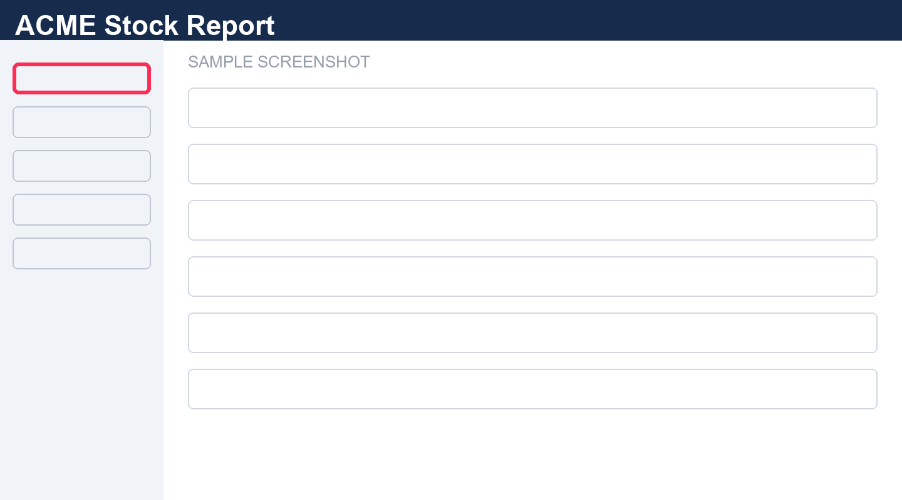
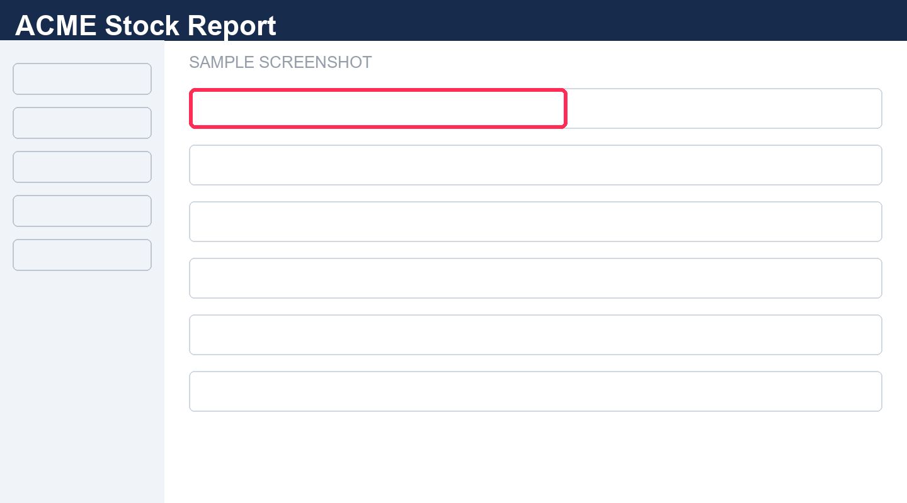

# การใช้งานระบบ ACME Stock Report

ACME Stock Report คือหน้ารายงานคลังสินค้าบน NetSuite ผู้ใช้งานเลือกคลัง กรองสินค้า และส่งออกข้อมูลได้ในหน้าเดียว คู่มือนี้อธิบายการใช้งานทีละขั้นตอนพร้อมภาพประกอบ

## เปิดรายงาน

คลิกเมนู **Stock Report** ในแถบด้านซ้าย (กรอบแดง) ระบบแสดงข้อมูลคลังทั้งหมดพร้อมตัวเลขสรุปด้านบน

| Fields | Description |
|---|---|
| Warehouse | คลังที่ต้องการดูข้อมูล เลือกได้จากรายการ |
| Item | รหัสและชื่อสินค้า |
| On Hand | จำนวนคงเหลือปัจจุบัน |

## กรองข้อมูล

พิมพ์รหัสสินค้าในช่องค้นหา (กรอบแดง) แล้วกด **Load** ระบบกรองข้อมูลใหม่จากฐานทั้งหมด ไม่ใช่เฉพาะหน้าที่แสดง

> หมายเหตุ: กรอกหลายเงื่อนไขพร้อมกันได้ ทุกช่องรวมกันแบบ "และ" (AND)

# คำถามที่พบบ่อย (FAQ)

**Q:** ต้องการข้อมูลครบทุกแถวทำอย่างไร

**A:** สั่ง Load All ก่อน Export ระบบดึงทุกแถวของเงื่อนไขปัจจุบันให้
